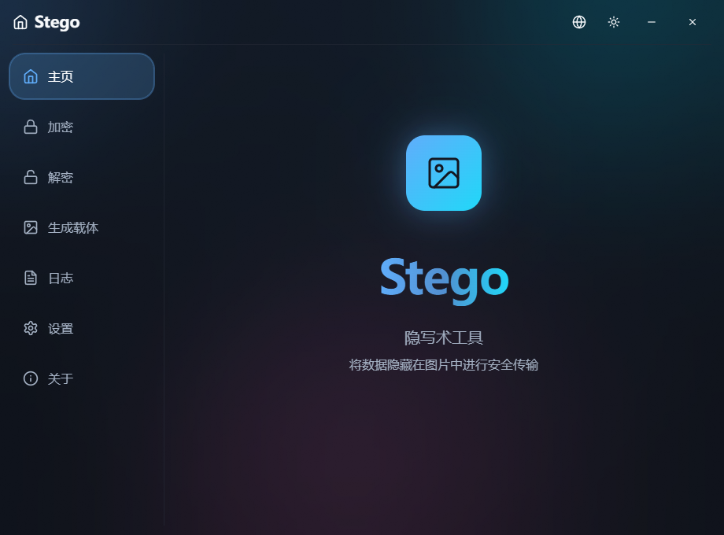
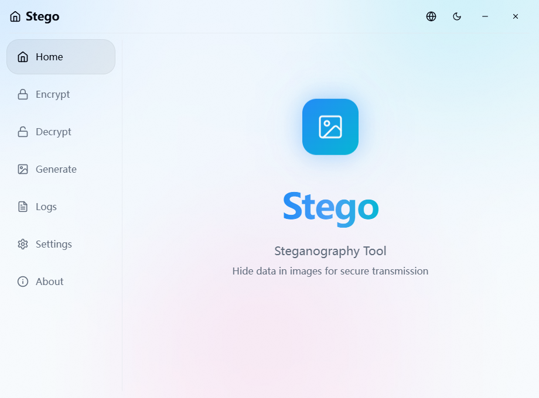
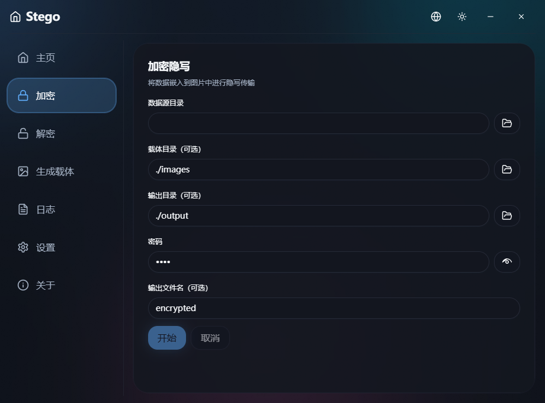
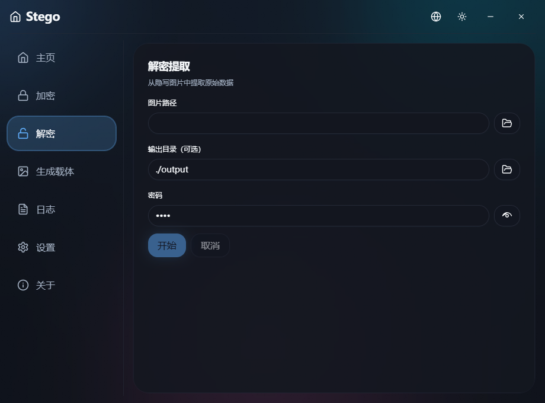
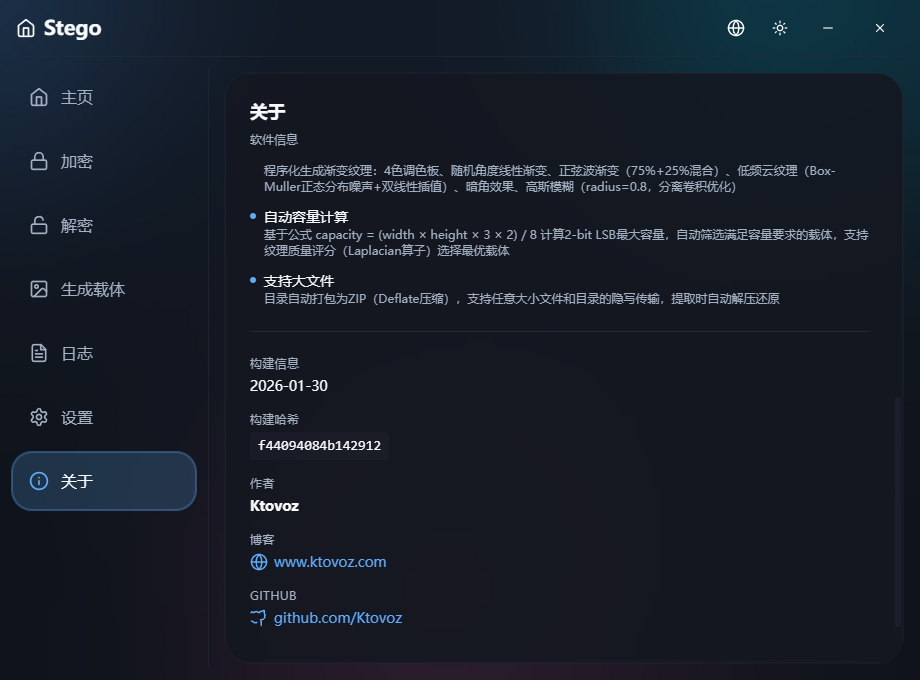

# Stego

<div align="center">

A secure image steganography desktop application with AES-256 encryption and Reed-Solomon error correction.

[](https://github.com/Ktovoz/Stego/actions/workflows/build.yml)
[](https://golang.org/)
[](https://wails.io/)
[](LICENSE)


</div>

---

## Overview

Stego is a secure desktop application that uses advanced steganography to hide files within PNG images. It combines military-grade encryption and error correction techniques to ensure your hidden data is both secure and resilient to image corruption.

### Key Features

- **AES-256-GCM Encryption** - Military-grade encryption for hidden files
- **Reed-Solomon Error Correction** - Data recovery even with corrupted images
- **Carrier Image Generation** - Batch generate gradient+noise PNG images
- **Automatic ZIP Compression** - Files are compressed before hiding
- **Cross-Platform** - Supports Windows, macOS, and Linux
- **Async Processing** - Background operations with progress display
- **Cancellable Operations** - Interrupt ongoing tasks at any time
- **Persistent Settings** - SQLite database for preferences

---

## How It Works

```
Encryption Flow:
File -> ZIP -> AES-256-GCM -> RS(255,223) ECC -> 2-bit LSB + Scatter -> PNG

Decryption Flow:
PNG -> Extract -> RS Decode -> AES Decrypt -> Unzip -> File
```

### Encryption Pipeline

1. **Compression** - Automatic ZIP compression
2. **Encryption** - AES-256-GCM authenticated encryption
3. **Error Correction** - Reed-Solomon RS(255,223) adds redundancy (~13% overhead)
4. **Interleaving** - Data interleaving for burst error resilience
5. **Embedding** - 2-bit LSB with scatter distribution for uniform embedding
6. **Output** - PNG image containing hidden data

### Why This Approach

- **Security**: AES-256-GCM ensures confidentiality and authenticity
- **Fault Tolerance**: RS(255,223) can recover up to ~16 bytes per 255-byte block
- **Stealth**: Scatter embedding distributes bits evenly throughout the image

---

## Screenshots

<table>
  <tr>
    <td></td>
    <td></td>
  </tr>
  <tr>
    <td></td>
    <td></td>
  </tr>
  <tr>
    <td></td>
  </tr>
</table>

---

## Installation

### Download Pre-built Releases

Coming soon! Support planned for:
- Windows (x64)
- macOS (Intel & Apple Silicon)
- Linux (x64)

### Build from Source

#### Prerequisites

- **Go** 1.23 or higher
- **Node.js** 18+ and npm
- **Wails CLI**

```bash
# Install Wails CLI
go install github.com/wailsapp/wails/v2/cmd/wails@latest
```

#### Build Steps

```bash
# Clone repository
git clone https://github.com/Ktovoz/Stego.git
cd Stego

# Install frontend dependencies
cd frontend && npm install && cd ..

# Build application
wails build
```

The executable will be located in `build/bin/`:
- Windows: `stego.exe`
- macOS/Linux: `stego`

---

## Usage

### Encrypt & Hide

1. Click the "Encrypt" tab
2. Select the file or folder to hide
3. (Optional) Set an encryption password
4. Select a carrier image
5. Click "Encrypt" and wait for completion
6. The output PNG image contains the hidden file

### Decrypt & Extract

1. Click the "Decrypt" tab
2. Select the PNG image containing hidden data
3. (Optional) Enter the encryption password
4. Click "Decrypt" and wait for completion
5. Extracted files will be saved to the output directory

### Generate Carrier Images

1. Click the "Generator" tab
2. Set target image size and quantity
3. Select output directory
4. Click "Generate" to create gradient+noise PNG images

### Settings

Configure preferences in the Settings tab:
- Default carrier image directory
- Default output directory
- Default encryption password (optional)
- Author information

---

## Development

```bash
# Run in development mode (with hot reload)
wails dev

# Run frontend linting
cd frontend && npm run lint

# Run Go tests
go test ./...
```

---

## Project Structure

```
stego/
├── internal/
│   ├── app/          # Application logic and handlers
│   ├── config/       # Configuration management
│   ├── crypto/       # AES, ECC, PBKDF2 implementations
│   ├── engine/       # Steganography engine (embed/extract)
│   ├── generator/    # Carrier image generator
│   ├── log/          # Logging utilities
│   └── models/       # Data models
├── frontend/         # React + Vite + Tailwind CSS
│   ├── src/
│   │   ├── components/   # UI components
│   │   ├── i18n/         # Internationalization
│   │   └── assets/       # Fonts and images
│   └── wailsjs/      # Wails auto-generated bindings
├── build/            # Build config and assets
├── app.go            # Wails application context
└── main.go           # Entry point
```

---

## Tech Stack

| Component | Technology |
|-----------|-----------|
| Backend | [Go](https://golang.org/) 1.23+ |
| Frontend | [React](https://react.dev/) + [Vite](https://vitejs.dev/) |
| UI Framework | [Tailwind CSS](https://tailwindcss.com/) |
| Desktop Framework | [Wails](https://wails.io/) v2 |
| Database | [SQLite](https://www.sqlite.org/) |
| Encryption | AES-256-GCM (Go crypto/aes) |
| Error Correction | Reed-Solomon RS(255,223) |
| Internationalization | [i18next](https://www.i18next.com/) |

---

## License

MIT License - See [LICENSE](LICENSE)

---

## Contributing

Contributions are welcome! Please feel free to submit a Pull Request.

---

## Acknowledgments

- Built with [Wails](https://wails.io/) - Go desktop application framework
- UI components from [shadcn/ui](https://ui.shadcn.com/)
- Error correction code based on Reed-Solomon implementation

---

## Disclaimer

This tool is for educational and legitimate purposes only. Users are responsible for complying with local laws regarding data encryption and steganography.

